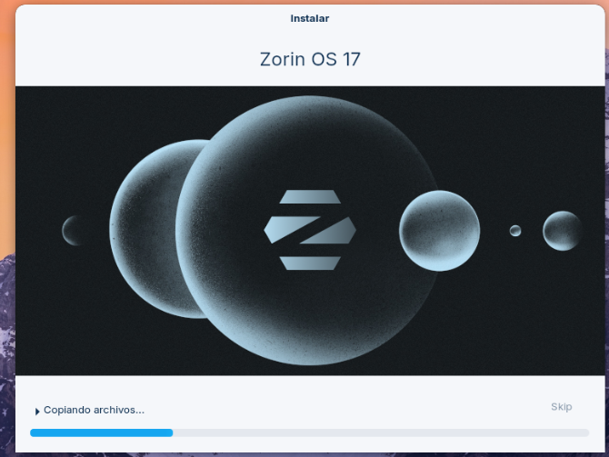

^^**Enunciat de la Tasca:** 

# **T06: Fonaments del servei DNS**

🧭 Guia d’Auditoria DNS — DigiCore / EverPia
📘 Fase Teòrica: Fonaments del Servei DNS
1.Jerarquia i Estructura del DNS

El DNS (Domain Name System) és una base de dades distribuïda en forma d’arbre que tradueix noms de domini en adreces IP.
L’estructura jeràrquica és:

Root (Arrel): Representada per un punt “.” al final del domini (per exemple, example.com.). Gestionada per 13 conjunts de Root Servers arreu del món.

TLD (Top Level Domain): Són dominis de primer nivell com .com, .org, .cat, .edu, etc.

Segon Nivell: El nom registrat per l’usuari o empresa, per exemple tecnocampus.cat.

Subdominis: Parts internes del domini principal, com www.tecnocampus.cat o mail.tecnocampus.cat.

2.Procés de Resolució de Noms

Quan un client vol accedir a un domini, es fa una consulta DNS:

Consulta Iterativa: El client pregunta a un servidor DNS, i aquest li indica quin altre servidor pot conèixer la resposta (no la resol completament).

Consulta Recursiva: El servidor DNS del client (normalment el de l’ISP) fa totes les consultes necessàries fins a obtenir la resposta final.

Servidors Autoritatius: Són aquells que tenen la informació original i verificable d’un domini.

Servidors Root: Punt de partida de totes les resolucions DNS.

3.Tipus de Zones

Zona Directa: Traducció de noms a IP (ex. tecnocampus.cat → 185.86.x.x).

Zona Inversa: Traducció d’IP a nom de domini (ex. 147.83.2.135 → host.upc.edu).

Zona Primària: Conté els fitxers originals de configuració DNS.

Zona Secundària: Una còpia de la zona primària utilitzada per redundància i equilibri de càrrega.

4.Tipus de Registres Clau (Records)

A: Associa un nom de domini a una adreça IPv4.

CNAME: Alias d’un altre nom de domini.

MX: Defineix els servidors de correu d’un domini.

NS: Indica els servidors de noms autoritatius per al domini.

TXT: Permet afegir informació addicional, com validacions SPF o dades de seguretat.

Conceptes Essencials

Resposta Autoritativa: Indica que la resposta prové d’un servidor amb autoritat sobre la zona. En eines com dig apareix com “aa” (authoritative answer).

TTL (Time To Live): Valor en segons que indica quant temps una resposta pot ser emmagatzemada en memòria cau abans de tornar-se a consultar.

SOA (Start of Authority): Conté informació clau sobre la zona: servidor principal, correu de l’administrador, número de sèrie, intervals de refresc i caducitat.

Reenviadors (Forwarders): Servidors DNS configurats per reenviar consultes a altres servidors.

Condicionals: S’apliquen només a dominis específics.

Incondicionals: Reenvien totes les consultes externes.

Resolució Local i mDNS: Els equips poden resoldre noms localment sense servidor DNS mitjançant el protocol mDNS (Multicast DNS), habitual en xarxes petites (per exemple, hostname.local).

🧪 Fase Pràctica: Diagnosi amb Eines CLI
🔍 1. Diagnosi Avançada amb dig (Linux/macOS)

Comanda 1: Consulta Bàsica de Registre A
Consulta: dig xtec.cat A
Anàlisi:

La resposta mostra la IP principal del domini (A record).

El camp TTL indica el temps de validesa de la resposta.

El camp SERVER mostra quin servidor DNS ha respost.

Comanda 2: Consulta de Servidors de Noms (NS)
Consulta: dig tecnocampus.cat NS
Anàlisi:

Retorna la llista de servidors autoritatius (nom i IP).

Permet identificar a quins servidors podem fer consultes directes.

Comanda 3: Consulta Detallada SOA
Consulta: dig escolapia.cat SOA
Anàlisi:

Mostra el servidor principal de la zona.

Inclou l’adreça de correu de l’administrador (format nom.admin@domini).

Mostra el número de sèrie, útil per sincronitzar zones primàries i secundàries.

Comanda 4: Consulta de Resolució Inversa
Consulta: dig -x 147.83.2.135
Anàlisi:

Retorna el nom associat a una IP.

Sovint indica el domini institucional o host específic corresponent a la IP.

💻 2. Comprovació amb nslookup (Windows / Linux / macOS)

Comanda 1: Consulta Bàsica no Autoritativa
Procediment:

Executar nslookup

Escriure set type=A

Consultar tecnocampus.cat
Anàlisi:

La resposta és “no autoritativa” perquè prové d’una memòria cau o d’un servidor intermediari, no directament del servidor autoritatiu.

Comanda 2: Consulta Autoritativa
Procediment:

Amb nslookup, escriure server IP (on IP és la d’un dels servidors NS del domini).

Consultar de nou tecnocampus.cat amb set type=A.
Anàlisi:

La resposta ara és “authoritative answer”.

S’observa informació directa del servidor que gestiona la zona.

Es pot veure un TTL diferent o detalls de registre més precisos.

🌐 3. Resolució Local i mDNS

En xarxes internes sense servidor DNS, els equips poden identificar-se mitjançant resolució local.

El protocol mDNS (Multicast DNS) permet resoldre noms de dispositius amb el sufix .local (exemple: impressora.local).

És habitual en entorns domèstics o d’oficina petita (sistemes macOS, Linux i Windows 10+).

No necessita servidor DNS extern, ja que les peticions es difonen per la LAN.

🧾 Resultats i Captures

A l’entrega final del projecte, s’han d’incloure:

Captures de pantalla de les cinc consultes (dig i nslookup).

Explicació sota cada captura amb l’anàlisi corresponent.

Fitxer guia.md amb aquest contingut teòric i pràctic.

Verificació del funcionament de resolució local (prova amb ping hostname.local).

📄 Conclusió

Aquest material forma part de la sessió formativa per al personal tècnic de DigiCore.
Permet entendre com funciona el DNS, com diagnosticar problemes habituals i com interpretar resultats de les principals eines CLI (dig, nslookup).
Un coneixement sòlid d’aquests conceptes és essencial per garantir una resolució de noms fiable, ràpida i segura dins de qualsevol infraestructura de xarxa.


|**RESPOSTA**|

# 🌐 **T06: Fonaments del Servei DNS**

---

## 🧩 **EXERCICI: Fase Pràctica — Diagnosi de Noms (Auditoria amb CLI)**

### 💻 Instal·lació de la màquina **Zorin**



---

### ⚙️ Configuració inicial

Un cop hem configurat l’idioma **“Español”** i hem afegit que el **país és Espanya**,  
hem de configurar **dues interfícies** de xarxa:

- **Primera interfície:** `NAT`  
- **Segona interfície:** `Adaptador pont` amb la IP correctament configurada

🧠 *L’exercici demana que la primera sigui NAT i la segona adaptador pont, després configurem la IP.*

---

### 🖥️ Obrir el terminal

1. Fes clic al menú de **Zorin**
2. Escriu **“terminal”**
3. Obre’l ✅

---

### 🔍 Comprovar eines DNS

Verifiquem si tenim instal·lades les ordres **`dig`** i **`nslookup`**:

```bash
dig -v
nslookup
🧠 PART A — Diagnosi Avançada amb dig
🧾 Comanda 1: Consulta Bàsica de Registre A
Ordre:

bash
Copia el codi
dig xtec.cat A
📄 Resultats:

TTL: 240

IP: 83.247.151.214

🧭 Comanda 2: Consulta de Servidors de Noms (NS)
Ordre:

bash
Copia el codi
dig tecnocampus.cat NS
📸 ![][image2]
📸 ![][image3]

Servidors de noms autoritatius:

ns1.tecnocampus.cat

ns2.tecnocampus.cat

🧩 Anàlisi:

Els registres NS indiquen quins servidors tenen autoritat sobre el domini.
El TTL representa el temps de validesa de la resposta.

📜 Comanda 3: Consulta Detallada SOA
Ordre:

bash
Copia el codi
dig escolapia.cat SOA
📸 ![][image4]
📸 ![][image5]

📧 Correu de l’administrador: dns1.nominalia.com
🔢 Número de sèrie: 1761028965

🧾 Explicació:
El registre SOA (Start Of Authority) conté informació de gestió i control de la zona DNS.

🔁 Comanda 4: Consulta de Resolució Inversa
Ordre:

bash
Copia el codi
dig -x 147.83.2.135
📸 ![][image6]
📜 “Possem aquesta comanda per que et doni la informació de forma mes detallada.”
📸 ![][image7]

🔍 Nom associat a la IP:
host147-83-2-135.uab.cat

⚠️ Si no apareix cap “ANSWER SECTION” o “Authoritative answers”, vol dir que no hi ha registre PTR configurat.

📸 ![][image8]

🧮 Comprovació de Resolució amb nslookup (Multiplataforma)
🧱 Comanda 1: Consulta Bàsica no Autoritativa
📸 ![][image9]

bash
Copia el codi
set type=A
tecnocampus.cat
📸 ![][image10]

📄 Resultat:

“Non-authoritative answer” → La resposta ve d’un servidor intermediari (caché DNS), no del servidor autoritatiu.

🏛️ Comanda 2: Consulta Autoritativa
Consulta prèvia:

bash
Copia el codi
dig NS tecnocampus.cat
Exemple de servidor autoritatiu: ns1.tecnocampus.cat

Configuració a nslookup:

bash
Copia el codi
server ns1.tecnocampus.cat
set type=A
tecnocampus.cat
📸 ![][image11]

✅ Ara la resposta és autoritativa, sense el text “Non-authoritative answer”.

📌 Diferències:

La resposta ve directament del servidor autoritatiu

El TTL pot variar

És la resposta oficial del domini

🔎 També podem provar amb escolapia.cat
📸 ![][image12]

🧭 Fase 2: Conceptes i Jerarquia DNS
🌲 1. Jerarquia i estructura del DNS
El DNS és com un arbre jeràrquic:

A dalt de tot hi ha l’arrel (Root)

Sota la Root hi ha els TLDs (.com, .cat, .es, etc.)

Després els dominis de segon nivell (google, openai...)

🧩 Exemple:
www.google.com = subdomini www + domini google + TLD .com

⚙️ 2. Procés de resolució
Quan escrius una URL, el teu ordinador busca la IP corresponent amb:

🔁 Consulta recursiva: el servidor DNS resol tot el procés i torna la resposta final

🪜 Consulta iterativa: el servidor et diu a quin altre servidor has de preguntar

📌 Hi ha servidors d’arrel, TLD i autoritius (els que tenen la informació final).

🗂️ 3. Tipus de zones
Tipus de Zona	Funció
Zona directa	Converteix un nom en IP → (ex: www.openai.com → 192.168.1.1)
Zona inversa	Converteix una IP en nom
Zona primària	Conté els registres originals
Zona secundària	Còpia sincronitzada de la primària

📋 4. Tipus de registres DNS
Tipus	Descripció
A	Associa un nom amb una adreça IPv4
CNAME	Crea un àlies que apunta a un altre nom
MX	Indica quin servidor rep el correu
NS	Defineix els servidors autoritatius
TXT	Conté informació extra (verificacions, seguretat, SPF, DKIM...)

💡 5. Conceptes essencials
Resposta autoritativa: ve del servidor amb la informació oficial

TTL (Time To Live): temps de validesa d’una resposta en caché

SOA (Start of Authority): informació administrativa de la zona (responsable, número de sèrie, intervals d’actualització…)

🚀 6. Reenviadors (Forwarders)
Condicionals: envien consultes segons el domini o tipus

Incondicionals: reenviament de totes les consultes a un mateix servidor

🏠 7. Resolució local i mDNS
El mDNS (Multicast DNS) permet resoldre noms dins d’una xarxa local sense servidors DNS centrals.
🔹 Exemple: connectar a una impressora amb un nom com impressora.local.
[Resposta de la tasca](Tasca06)

[Video](Video)
